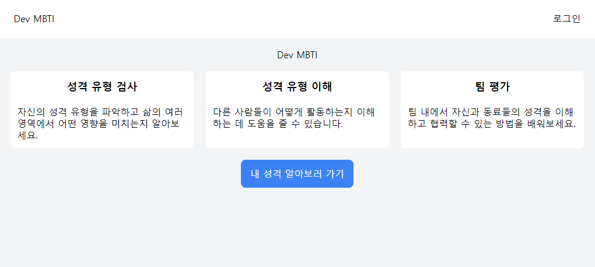
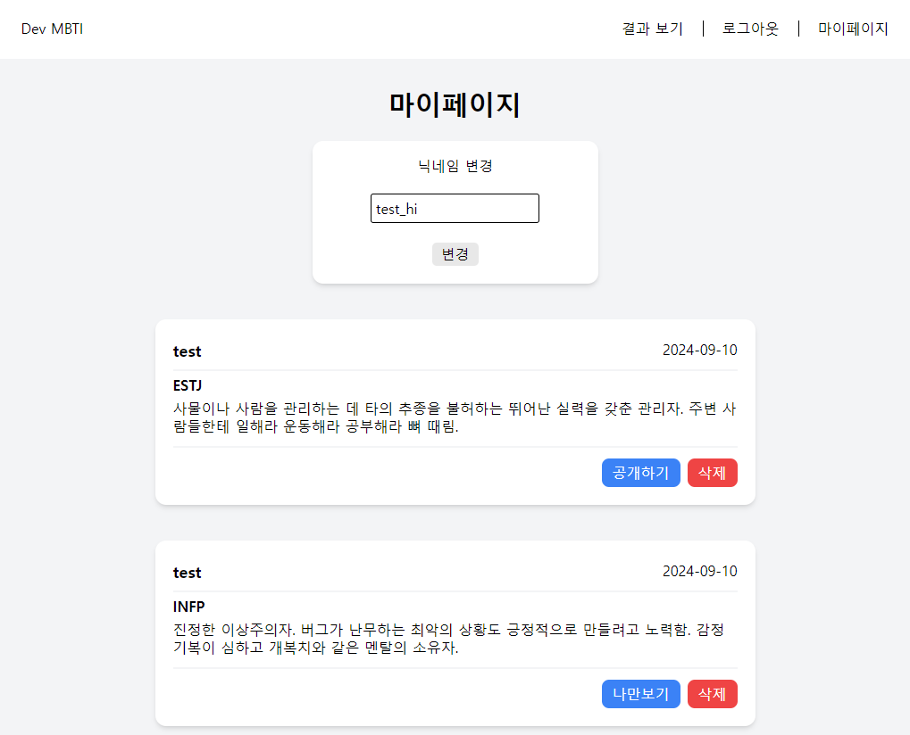

# MBTI 테스트

회원가입 후 로그인하면 mbti 검사를 할 수 있습니다. 로그인 후 다른 사람들의 검사 결과도 확인할 수 있으며, 본인의 테스트 결과는 비공개로 바꿀 수 있습니다. 또한 사용자 닉네임도 변경 가능합니다.

##
- `TanStack Query` 적용
  - `axios`를 통해 불러온 데이터를 TanStack Query를 이용해 관리합니다.
  - 공개 여부 변경 또는 삭제 시 `invalidateQueries`를 실행해 새로 데이터를 가져오도록 합니다.

- `Zustand` 적용
  - `Zustand`를 통해 로그인 정보를 전역상태로 관리합니다.

- Local storage를 통한 토큰 관리
  - 로그인 시 local storage에 토큰을 저장해 로그인 정보를 저장합니다.
  - 새로고침 시 토큰 유무를 확인해 로그인 상태를 유지합니다.

##
- 수정이 필요한 부분
  - 새로고침 후 토큰이 만료됐을 때, 알림창이 두 번 뜨는 오류